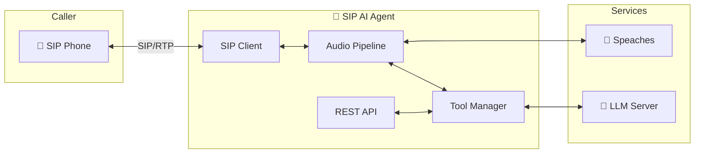

## 🎉 v0.1.0
# 📞⚡ General Dissarray
## 🤖 SIP Enabled AI Agent

> 🤖 **ROBO CODED** — This release was made with AI and may not be 100% sane. But the code does work! 🎉

**Release Date:** November 30, 2025  
**License:** AGPL-3.0  
**Platform:** NVIDIA DGX Spark (Grace Blackwell GB10)

---

## 🚀 Overview

The first public release of **SIP AI Assistant** — a voice-powered AI assistant that answers phone calls, understands natural language, and performs actions through an extensible plugin system.

Built for the NVIDIA DGX Spark with 128GB unified memory, this system runs entirely on local infrastructure with no cloud dependencies for voice processing or LLM inference.

---

## ✨ Highlights

```
┌─────────────────────────────────────────────────────────────┐
│ 📞 SIP AI Assistant v0.1.0                                  │
├─────────────────────────────────────────────────────────────┤
│ ✅ Full SIP/RTP voice call handling                        │
│ ✅ Real-time STT via Whisper (Speaches)                    │
│ ✅ Natural TTS via Kokoro (Speaches)                       │
│ ✅ LLM integration (vLLM, OpenAI, Ollama)                  │
│ ✅ 10 built-in tools                                        │
│ ✅ Plugin system for custom tools                          │
│ ✅ REST API for outbound calls                             │
│ ✅ Scheduled & recurring calls                             │
│ ✅ Customizable phrases                                     │
│ ✅ Full observability stack                                 │
└─────────────────────────────────────────────────────────────┘
```

---

## 🔧 Built-in Tools

| Tool | Description |
|------|-------------|
| 🌤️ `WEATHER` | Current weather from Tempest station |
| ⏲️ `SET_TIMER` | Countdown timers with voice alerts |
| 📞 `CALLBACK` | Schedule callbacks to any number |
| 📴 `HANGUP` | End calls gracefully |
| 📋 `STATUS` | Check pending timers/callbacks |
| ❌ `CANCEL` | Cancel scheduled tasks |
| 🕐 `DATETIME` | Current date and time |
| 🧮 `CALC` | Math calculations |
| 😄 `JOKE` | Random jokes (general, tech, dad) |
| 🦜 `SIMON_SAYS` | Echo back verbatim |

---

## 🌐 REST API

| Endpoint | Method | Description |
|----------|--------|-------------|
| `/health` | GET | Health check |
| `/call` | POST | Initiate outbound call |
| `/call/{id}` | GET | Get call status |
| `/call/{id}` | DELETE | Hang up call |
| `/tools` | GET | List available tools |
| `/tools/{name}/call` | POST | Execute tool via call |
| `/schedule` | POST | Schedule a call |
| `/schedule` | GET | List scheduled calls |
| `/schedule/{id}` | DELETE | Cancel scheduled call |

### Scheduled Calls

```bash
# One-time call
curl -X POST http://localhost:8080/schedule \
  -d '{"extension": "1001", "tool": "WEATHER", "at_time": "07:00"}'

# Recurring daily
curl -X POST http://localhost:8080/schedule \
  -d '{"extension": "1001", "tool": "WEATHER", "at_time": "07:00", "recurring": "daily"}'

# Weekdays only
curl -X POST http://localhost:8080/schedule \
  -d '{"extension": "1001", "message": "Stand up time!", "at_time": "09:00", "recurring": "weekdays"}'
```

---

## 🗣️ Customizable Phrases

Configure the assistant's personality via environment variables or JSON:

**Environment Variables:**
```env
PHRASES_GREETINGS=["Hello!","Hi there!","Hey!"]
PHRASES_GOODBYES=["Goodbye!","Take care!"]
PHRASES_ACKNOWLEDGMENTS=["Okay.","Got it.","Sure."]
PHRASES_THINKING=["One moment.","Let me check."]
PHRASES_ERRORS=["Sorry, I didn't catch that."]
PHRASES_FOLLOWUPS=["Anything else?"]
```

**JSON File** (`data/phrases.json`):
```json
{
  "greetings": ["Beep boop! What do you want, human?"],
  "goodbyes": ["Bye, meatbag!"],
  "errors": ["My audio sensors must be malfunctioning."]
}
```

---

## 🔌 Plugin System

Create custom tools with Python:

```python
from tool_plugins import BaseTool, ToolResult, ToolStatus

class MyTool(BaseTool):
    name = "MY_TOOL"
    description = "Does something cool"
    
    parameters = {
        "input": {"type": "string", "required": True}
    }
    
    async def execute(self, params):
        return ToolResult(
            status=ToolStatus.SUCCESS,
            message=f"You said: {params['input']}"
        )
```

---

## 📊 Observability

| Feature | Technology |
|---------|------------|
| 📈 Metrics | Prometheus |
| 🔍 Tracing | OpenTelemetry / Tempo |
| 📝 Logging | Structured JSON |
| 📊 Dashboards | Grafana |

**Key Metrics:**
- `sip_agent_calls_total` — Total calls handled
- `sip_agent_call_duration_seconds` — Call duration histogram
- `sip_agent_tool_calls_total` — Tool invocations by name
- `sip_agent_stt_latency_seconds` — Speech-to-text latency
- `sip_agent_tts_latency_seconds` — Text-to-speech latency
- `sip_agent_llm_latency_seconds` — LLM response latency

---

## 🏗️ Architecture



---

## 🖥️ System Requirements

### Recommended: NVIDIA DGX Spark

```
┌─────────────────────────────────────────────────────────────┐
│ 🟢 NVIDIA DGX Spark                                         │
├─────────────────────────────────────────────────────────────┤
│ 🧠 Grace Blackwell GB10 Superchip                          │
│ 💾 128GB Unified Memory                                     │
│ ⚡ 1 PFLOP AI Performance                                   │
└─────────────────────────────────────────────────────────────┘
```

### Minimum Requirements

| Component | Requirement |
|-----------|-------------|
| CPU | 8+ cores |
| RAM | 32GB |
| GPU | NVIDIA with 16GB+ VRAM |
| Storage | 50GB SSD |
| Network | Gigabit Ethernet |

### Software Dependencies

| Dependency | Version |
|------------|---------|
| Python | 3.11+ |
| Docker | 24.0+ |
| Docker Compose | 2.20+ |
| Speaches | Latest |

---

## 📦 Installation

```bash
# Clone repository
git clone https://github.com/your-org/sip-agent.git
cd sip-agent

# Configure
cp sip-agent/.env.example sip-agent/.env
nano sip-agent/.env

# Start
docker compose up -d

# Verify
curl http://localhost:8080/health
```

---

## 📚 Documentation

Full documentation available at **[sip-agent.readme.io](https://sip-agent.readme.io)**

| Document | Description |
|----------|-------------|
| [Overview](https://sip-agent.readme.io/docs/overview) | Architecture and features |
| [Getting Started](https://sip-agent.readme.io/docs/getting-started) | Installation guide |
| [Configuration](https://sip-agent.readme.io/docs/configuration) | Environment variables |
| [API Reference](https://sip-agent.readme.io/docs/api-reference) | REST API endpoints |
| [Tools](https://sip-agent.readme.io/docs/tools) | Built-in tools |
| [Plugins](https://sip-agent.readme.io/docs/plugins) | Custom tool development |
| [Examples](https://sip-agent.readme.io/docs/examples) | Integration patterns |

---

## ⚠️ Known Limitations

- WebSocket realtime STT mode is experimental (use `STT_MODE=batch` for stability)
- Maximum concurrent calls limited by LLM server capacity
- Weather tool requires Tempest station (or customize for other APIs)
- Some TTS voices may struggle with unusual words or names

---

## 🔜 Roadmap

| Feature | Status |
|---------|--------|
| 🎵 Music on hold | Planned |
| 📞 Call transfer | Planned |
| 🗓️ Calendar integration | Planned |
| 🔍 Web search tool | Planned |
| 🏠 Home Assistant native | Planned |
| 📱 SMS notifications | Planned |
| 🌍 Multi-language support | Planned |

---

## 🙏 Acknowledgments

- [NVIDIA DGX Spark](https://www.nvidia.com/en-us/products/workstations/dgx-spark/) — AI supercomputer platform
- [Speaches](https://github.com/speaches-ai/speaches) — Unified STT/TTS server
- [PJSIP](https://www.pjsip.org/) — SIP stack
- [FastAPI](https://fastapi.tiangolo.com/) — REST API framework
- [WeatherFlow Tempest](https://tempestwx.com/) — Weather data

---

## 📜 License

```
SPDX-License-Identifier: AGPL-3.0-or-later

This program is free software: you can redistribute it and/or modify
it under the terms of the GNU Affero General Public License as published
by the Free Software Foundation, either version 3 of the License, or
(at your option) any later version.
```

---

## 📞 Support

| Resource | Link |
|----------|------|
| 📖 Docs | [sip-agent.readme.io](https://sip-agent.readme.io) |
| 🐛 Issues | [GitHub Issues](https://github.com/your-org/sip-agent/issues) |
| 💬 Discussions | [GitHub Discussions](https://github.com/your-org/sip-agent/discussions) |

---

<p align="center">
  <b>SIP AI Assistant v0.1.0</b><br>
  Made with ❤️ and 🤖<br>
  <i>Now go make some calls!</i> 📞
</p>
